# Como configurar/instalar o `Microsoft Office 2016` no `Linux Ubuntu`

## Resumo

Neste documento estão contidos os principais comandos e configurações para instalar/configurar o `Microsoft Office 2016` no `Linux Ubuntu`.

## _Abstract_

_This document contains the main commands and settings to install/configure the `Microsoft Office 2016` on `Linux Ubuntu`._


## Descrição [2]

### `Microsoft Office 2016`

O `Microsoft Office 2016` é uma suíte de aplicativos de produtividade lançada pela `Microsoft`, que oferece ferramentas essenciais tanto para usuários domésticos quanto para empresas. Inclui programas populares como `Word`, `Excel`, `PowerPoint`, `Outlook`, `Access` e `Publisher`, cada um com funções específicas que vão desde a criação de documentos de texto e gerenciamento de _e-mails_, até análise de dados e apresentações dinâmicas. O `Office 2016` trouxe melhorias significativas em colaboração e segurança, integrando-se com o `OneDrive` e outros serviços em nuvem, e apresentando recursos como a coautoria em tempo real e a proteção de dados avançada, refletindo as necessidades de um ambiente de trabalho mais conectado e seguro.


## 1. Como baixar o arquivo `.iso` do `Microsoft Office 2016`

1. Acessar o _website_ <https://massgrave.dev/>

<div align="center">
    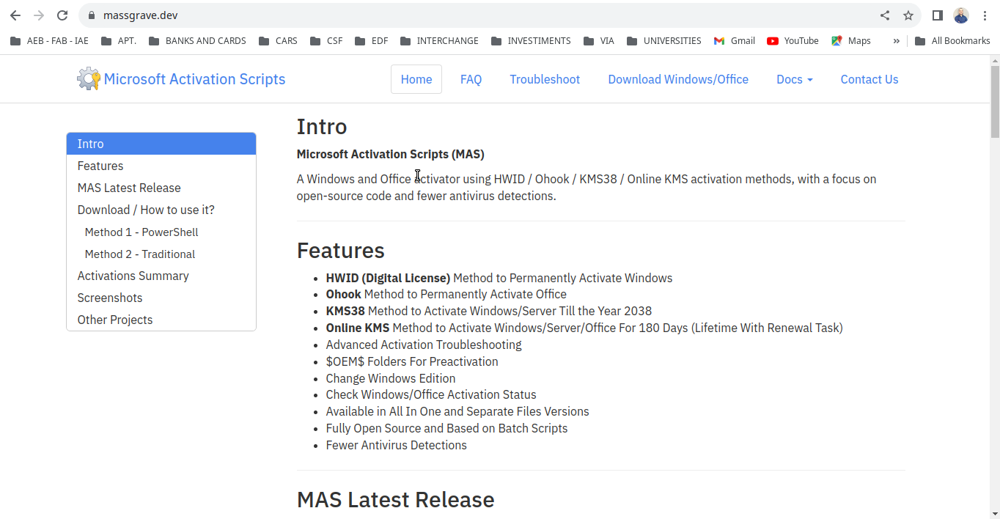
    <p>Fig. 1. https://massgrave.dev. </p>
</div>

2. Clicar em `Download Windows/Office`

<div align="center">
    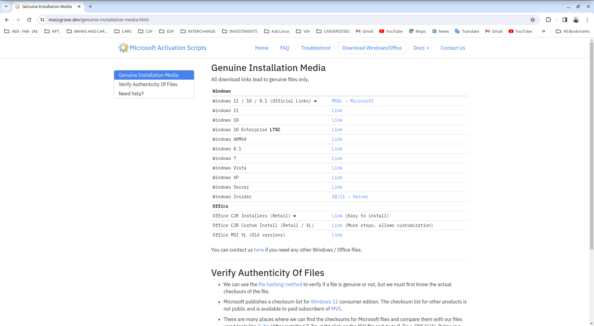
    <p>Fig. 2. https://massgrave.dev/#Download__How_to_use_it.</p>
</div>


3. Clicar em `Office MSI VL (Old versions)`

<div align="center">
    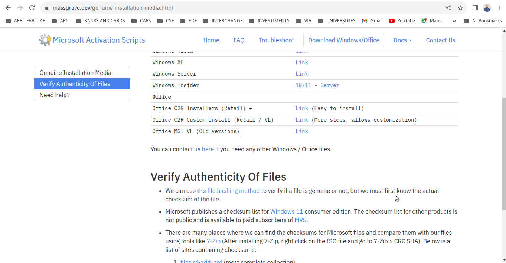
    <p>Fig. 3. https://massgrave.dev/genuine-installation-media.html#Verify_Authenticity_Of_Files.</p>
</div>


4. Clicar em `Office MSI VL Download`

<div align="center">
    
    <p>Fig. 4. `Office MSI VL Download`.</p>
</div>


5. Clicar me `Office 2016 Pro Plus`

<div align="center">
    
    <p>Fig. 5. `Office 2016 Pro Plus`.</p>
</div>


6. Clicar me `SW_DVD5_Office_Professional_Plus_2016_W32_English_MLF_X20-41353.ISO`

<div align="center">
    
    <p>Fig. 6. `SW_DVD5_Office_Professional_Plus_2016_W32_English_MLF_X20-41353.ISO`.</p>
</div>

7. Salvar o arquivo em um pasta.

## 2. Configurar/Instalar/Usar o `wine` para a versão mais atualizada e estável

Para configurar/instalar/usar o `Wine` no `Linux Ubuntu`, você pode seguir os passos abaixo:

1. **Aqui está um guia passo a passo**: `https://github.com/edftechnology/wine`


## 3. Configurar/Instalar/Usar o `playonlinux` para a versão mais atualizada e estável

Para atualizar o `playonlinux` no `Linux Ubuntu`, você pode seguir os passos abaixo:

1. **Aqui está um guia passo a passo**: `https://github.com/edftechnology/playonlinux`


## 4. Configurar o `PlayOnLinux (POL)` [5]

### 4.1 Passos iniciais

**A considerar :** `Wine x86` versão `4.15` é mais estável que `3.4` (abaixo) ou `3.14` (postagem
do `GlasierXplor` no `POL` Fórum). Ou seja, ele não trava aleatoriamente. A ressalva é que haverá
alguns problemas com as imagens, mas deverá funcionar bem 97% das vezes. O `Wine 4.15` requer a 
instalação da atualização `POL 4.3.4` dos repositórios oficiais do `PlayOnLinux (POL)`.

1. A versão `3.4` do `Wine x86` foi usada para esta instalação, então verifique se ele está
instalado iniciando o `PlayOnLinux (POL)` e selecionando `Tools-> Manage Wine versions`. Janela
Gerenciar versões do `Wine` com `x86` versão `3.4` instalada

<div align="center">
    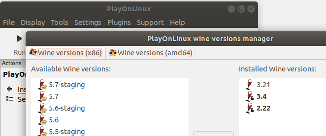
    <p>Fig. 7. PlayOnLinux wine versions manager.</p>
</div>

2. Se o `Wine x86` versão `3.4` não aparecer em `Installed Wine versions`, selecione-a na janela
`Available Wine versions:` e clique no botão `>` meio da janela para instalá-lo. Depois de
instalado, **feche** e saia para o menu principal do `PlayOnLinux (POL)`.

3. No `PlayOnLinux (POL)`, selecione `Configure` para entrar na tela de configuração e clique `New`
no canto inferior esquerdo para iniciar o criador do _drive_ virtual.

4. Selecione instalação do `Windows` de `32 bits` e pressione `Next`. Jogue no `Linux 32`
instalação do `Windows` de `32 bits`

<div align="center">
    
    <p>Fig. 8. PlayOnLinux Wizard .</p>
</div>

5. Selecione `Wine` versão `3.4` e pressione `Next`.

6. Dê um nome ao _drive_ virtual (por exemplo `wine34office2016pp`) e pressione `Next` para iniciar a
criação. Selecione para instalar o `Mono` se o `POL` solicitar.

7. Assim que a criação da unidade virtual for concluída, você deverá retornar à tela principal de
configuração do `PlayOnLinux (POL)`. Certifique-se de que a unidade recém-criada (por exemplo
`wine34office2016pp`) esteja selecionada na janela esquerda.

### 4.2 Instalar componentes

#### 4.2.1 Instalar componentes pelo `PlayOnLinux (POL)`

Depois de executar os passos da Seção anterior, execute:

1. Clique na guia `Install components` na parte superior. Em seguida, role para baixo para
selecionar `msxml6e` clique em `Install`.

<div align="center">
    
    <p>Fig. 9. PLayOnLinux configuration .</p>
</div>

2. **Repita a etapa acima para instalar o(s) componente(s)**: o prefixo ideal deve ter:

    - `dotnet40`

    - `msxml6`

    - `riched20`

    - `vcrun2013`

    - `corefonts`

#### 4.2.2 Instalar os componentes pelo `Terminal Emulator` (recomendado)

Ao invés de instalar os componentes pelo `PlayOnLinux (POL)`, você pode instalar pelo `Terminal Emulator`, como segue:

1. Você pode instalar tudo de uma vez manualmente:

    ```bash
    WINEPREFIX=~/.PlayOnLinux/wineprefix/wine34office2016pp winetricks dotnet40 msxml6 riched20 vcrun2013 corefonts
    ```

    **ATENÇÃO**: Perceba que, se você instalar o ambiente com outra versão do `wine`, você terá que alterar o
    nome de `wine34office2016pp` conforme o nome que você criou, por exemplo, para a versão do
    `wine 3.14` pode ser `wine314office2016pp`.

### 4.3 Passos finais

1. Selecione a guia `Wine` na tela Configuração `PlayOnLinux (POL)` e clique em `Configure Wine`.

2. Assim que a tela Configuração do `Wine` aparecer, clique na guia `Libraries`. Clique em
`Edit...` para alterar `msxml6` e `riched20` para `(native, builtin)` ou `Native then Builtin`.

<div align="center">
    
    <p>Fig. 10. Wine Configuration - Edit override.</p>
</div>

3. Na tela de configuração do `Wine`, clique na aba `Applications` e certifique-se de que
`Windows 7` esteja selecionada como a versão do `Windows`. Saia para a tela de configuração do
`PlayOnLinux (POL)`.

<div align="center">
    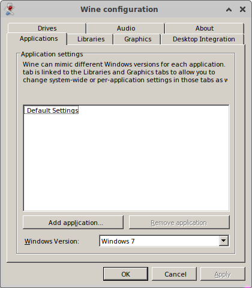
    <p>Fig. 18. Wine Configuration - Applications.</p>
</div>

4. Selecione a guia `Wine` na tela Configuração `PlayOnLinux (POL)` e clique em `Registry Editor`
para abrir o Editor do Registro.

5. Selecione para `HKEY_CURRENT_USER-> Software-> Wine`

6. Clique `Edit-> New-> Key` e nomeie esta chave `Direct2D`.

7. Selecione `Direct2D` e então `Edit-> New-> DWORD Value` e nomeie para `max_version_factory`
com um valor de `0`.

<div align="center">
    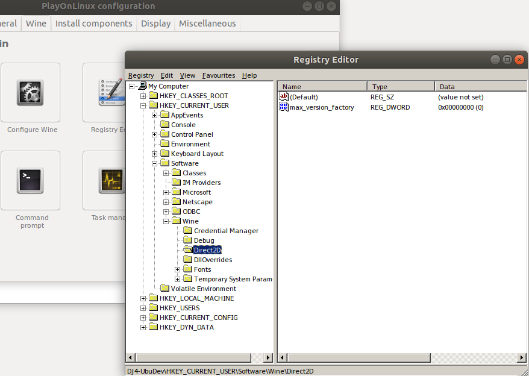
    <p>Fig. 11. Registry Editor .</p>
</div>

8. Feche o `Registry Editor` e retorne à tela Configuração do `PlayOnLinux (POL)`.


## 5. Configurar/Instalar/Usar o `Microsoft Office 2016` no `Linux Ubuntu` (caso ainda não esteja instalado) [1]

Para configurar/instalar/usar o `Microsoft Office 2016` no `Linux Ubuntu`, siga os passos abaixo::

1. Abrir o `Terminal Emulator`. Você pode fazer isso pressionando:

    ```bash
    Ctrl + Alt + T
    ```


2. Certifique-se de que seu sistema esteja limpo e atualizado.

    2.1 Limpar o `cache` do gerenciador de pacotes `apt`. Especificamente, ele remove todos os arquivos de pacotes (`.deb`) baixados pelo `apt` e armazenados em `/var/cache/apt/archives/`. Digite o seguinte comando:
    
    ```bash
    sudo apt clean
    ``` 
    
    2.2 Remover pacotes `.deb` antigos ou duplicados do cache local. É útil para liberar espaço, pois remove apenas os pacotes que não podem mais ser baixados (ou seja, versões antigas de pacotes que foram atualizados). Digite o seguinte comando:
    
    ```bash
    sudo apt autoclean
    ```

    2.3 Remover pacotes que foram automaticamente instalados para satisfazer as dependências de outros pacotes e que não são mais necessários. Digite o seguinte comando:
    
    ```bash
    sudo apt autoremove -y
    ```

    2.4 Buscar as atualizações disponíveis para os pacotes que estão instalados em seu sistema. Digite o seguinte comando e pressione `Enter`: 
    
    ```bash
    sudo apt update
    ```

    2.5 **Corrigir pacotes quebrados**: Isso atualizará a lista de pacotes disponíveis e tentará corrigir pacotes quebrados ou com dependências ausentes:
    
    ```bash
    sudo apt --fix-broken install
    ```

    2.6 Limpar o `cache` do gerenciador de pacotes `apt`. Especificamente, ele remove todos os arquivos de pacotes (`.deb`) baixados pelo `apt` e armazenados em `/var/cache/apt/archives/`. Digite o seguinte comando:
    
    ```bash
    sudo apt clean
    ``` 
    
    2.7 Para ver a lista de pacotes a serem atualizados, digite o seguinte comando e pressione `Enter`:  
    
    ```bash
    sudo apt list --upgradable
    ```

    2.8 Realmente atualizar os pacotes instalados para as suas versões mais recentes, com base na última vez que você executou `sudo apt update`. Digite o seguinte comando e pressione `Enter`:
    
    ```bash
    sudo apt full-upgrade -y
    ```

3. **Adicionar os repos oficiais do `Linux Ubuntu`**: Execute:

    ```bash
    sudo add-apt-repository main -y
    sudo add-apt-repository restricted -y
    sudo add-apt-repository universe -y
    sudo add-apt-repository multiverse -y
    sudo apt update
    ```
    
4. Para instalar o `7zip`, digitar o comando:

    ```bash
    sudo apt install p7zip-full -y
    ```

5. Cria a pasta com o mesmo nome do arquivo `.iso`, se ela não existir:

    ```bash
    mkdir -pv SW_DVD5_Office_Professional_Plus_2016_W32_English_MLF_X20-41353
    ``` 

6. Para extrair o arquivo `.iso`, digitar o comando:

    ```bash
    7z x SW_DVD5_Office_Professional_Plus_2016_W32_English_MLF_X20-41353.iso -o SW_DVD5_Office_Professional_Plus_2016_W32_English_MLF_X20-41353
    ```

7. Para instalar o `winbind`, digitar o comando:

    ```bash
    sudo apt install winbind -y
    ```

8. Para instalar o `playonlinux`, digitar o comando:

    8.1  **Instalar dependências necessárias**: Primeiro, instale as dependências necessárias para compilar o `wxPython`:

    ```bash
    sudo apt install build-essential libgtk-3-dev libjpeg-dev libtiff-dev libpng-dev libwxgtk3.0-gtk3-dev -y
    ```

    8.2 **Tentar instalar `wxPython` novamente**: Agora, tente instalar o `wxPython` novamente usando `pip`: 
    
    ```bash
    python3 -m pip install wxPython
    ```

    8.3 **Instalar o `playonlinux`**:
    
    ```bash
    sudo apt install playonlinux -y
    ```

    8.4 **Instalar o módulo `natsort`**: Use o pip para instalar o módulo `natsort`:
    
    ```bash
    python3 -m pip install natsort
    ```

9. Para abrir o `playonlinux`, digitar o comando:

    ```bash
    playonlinux
    ```


10. Clicar em `Install a program`:

<div align="center">
    
    <p>Fig. 12. `Install a program`.</p>
</div>


11. Clicar em `Search`:

<div align="center">
    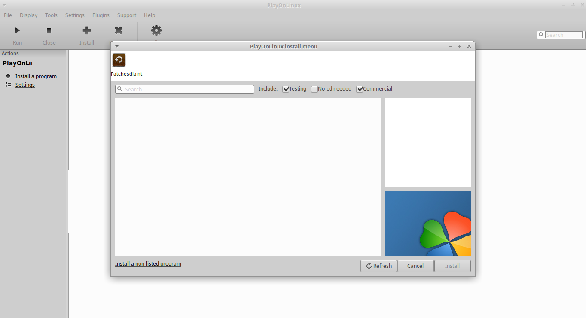
    <p>Fig. 13. `Search`.</p>
</div>


12. Digitar `Microsoft Office 2016 (method B)`:

<div align="center">
    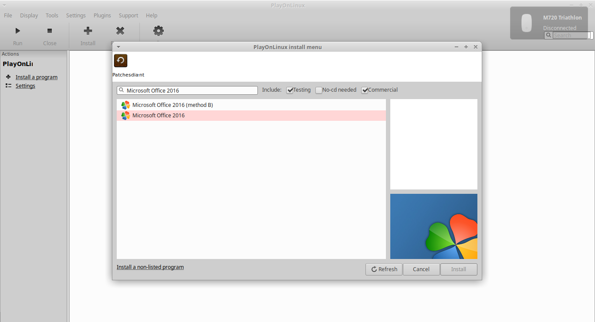
    <p>Fig. 14. `Microsoft Office 2016`.</p>
</div>


13. Clicar em `Microsoft Office 2016 (method B)`:

<div align="center">
    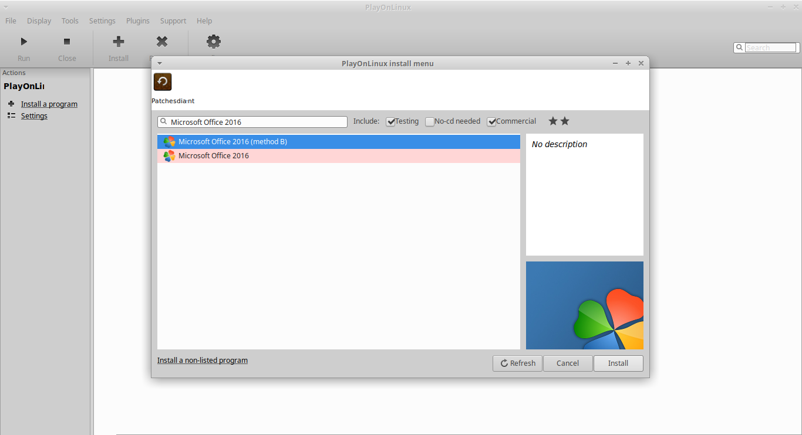
    <p>Fig. 15. `Microsoft Office 2016 (method B)`.</p>
</div>


14. Clicar em `Install`:

<div align="center">
    
    <p>Fig. 16. `Install`.</p>
</div>


15. Clicar em `Next`:

<div align="center">
    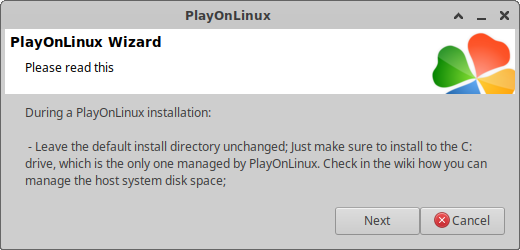
    <p>Fig. 17. `PlayOnLinux - During a PlayOnLinux Installation`.</p>
</div>


16. Clicar em `Next`:

<div align="center">
    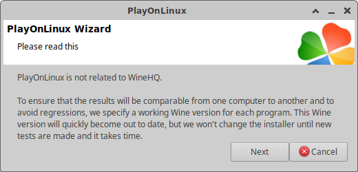
    <p>Fig. 18. `PlayOnLinux - PlayOnLinux is not related to WineHQ`.</p>
</div>


17. Clicar em `Next`:

<div align="center">
    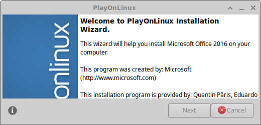
    <p>Fig. 19. `PlayOnLinux - Welcome to PlayOnLinux Installation Wizard`.</p>
</div>


18. Seguir com as instruções do arquivo de instalação executável`.exe`

<div align="center">
    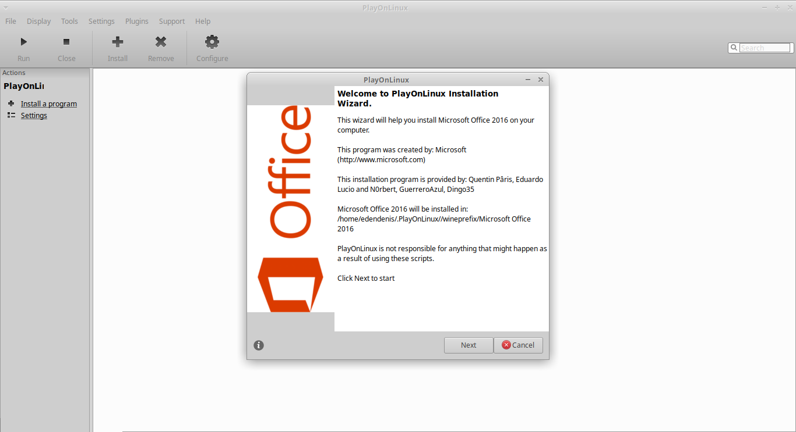
    <p>Fig. 20. Instalador do `Microsoft Office 2016`.</p>
</div>


## Referências

[1] OPENAI.
**Instalar o `microsoft office 2016` no `linux ubuntu` pelo `terminal emulator`.**
Disponível em: <https://chat.openai.com/c/f4373ad1-fde7-48c6-933a-91a70564cb26> (texto adaptado).
ChatGPT.
Acessado em: 05/11/2023 23:22.

[2] OPENAI.
**Instalar o `bottles` no `linux ubuntu` pelo `terminal emulator`.**
Disponível em: <https://chat.openai.com/c/92444ccc-f995-4e9c-8f03-678931882241> (texto adaptado).
ChatGPT.
Acessado em: 01/11/2023 19:17.

[3] OPENAI.
**Extrair iso com 7-zip.**
Disponível em: <https://chat.openai.com/c/9aeb16fc-d4dc-4a5b-a7eb-cd82d851d7b7> (texto adaptado).
ChatGPT.
Acessado em: 06/11/2023 09:37.

[4] OPENAI.
**Converter arquivo `.iso` em `.img`.**
Disponível em: <https://chat.openai.com/c/498fa917-4067-4fc5-b69d-31c9514dc47e> (texto adaptado).
ChatGPT.
Acessado em: 23/11/2023 13:47.

